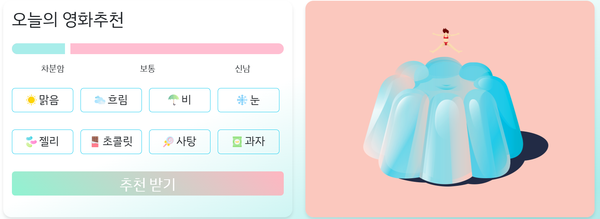
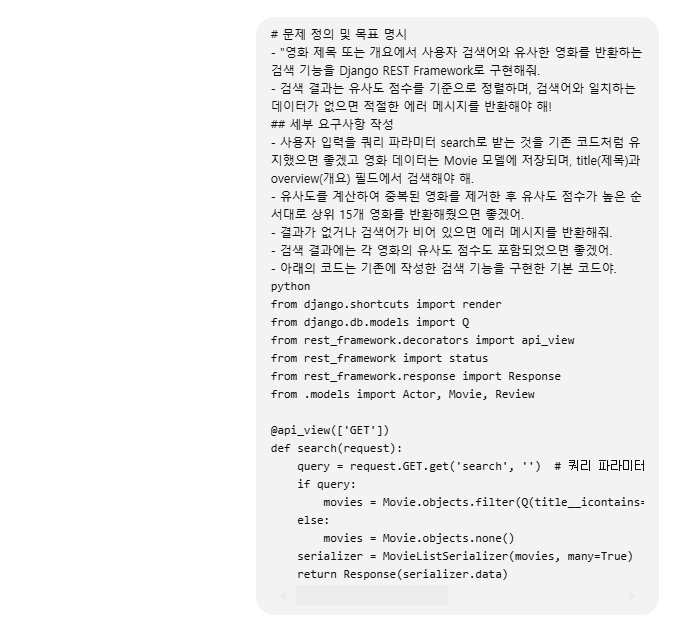
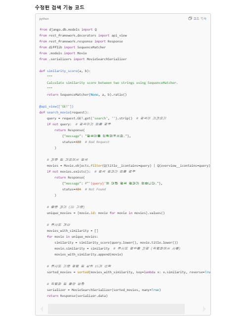
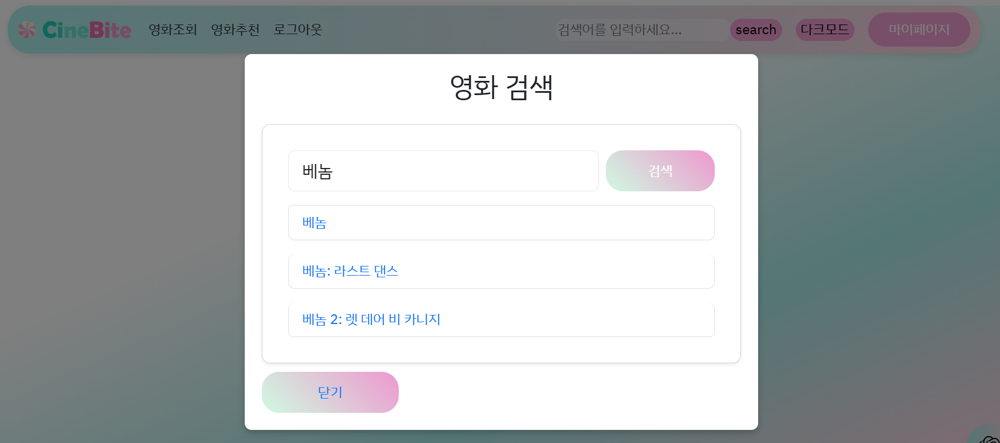
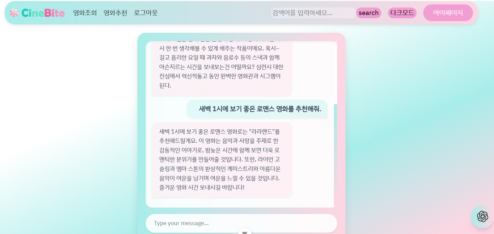
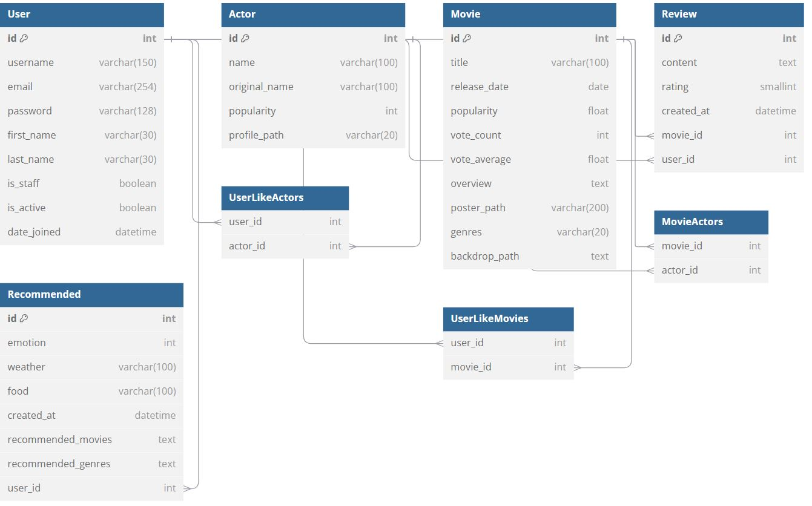
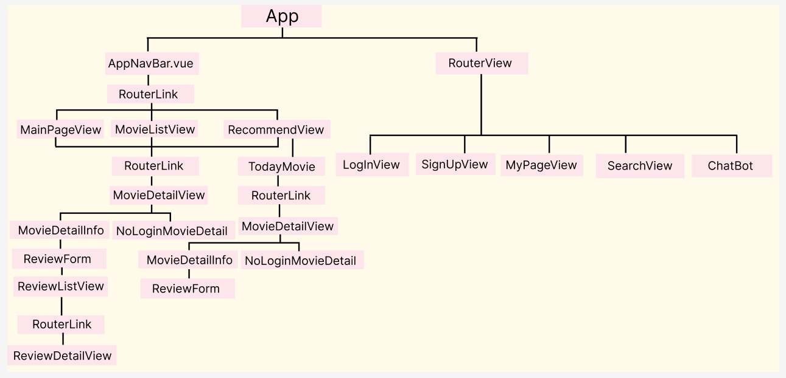
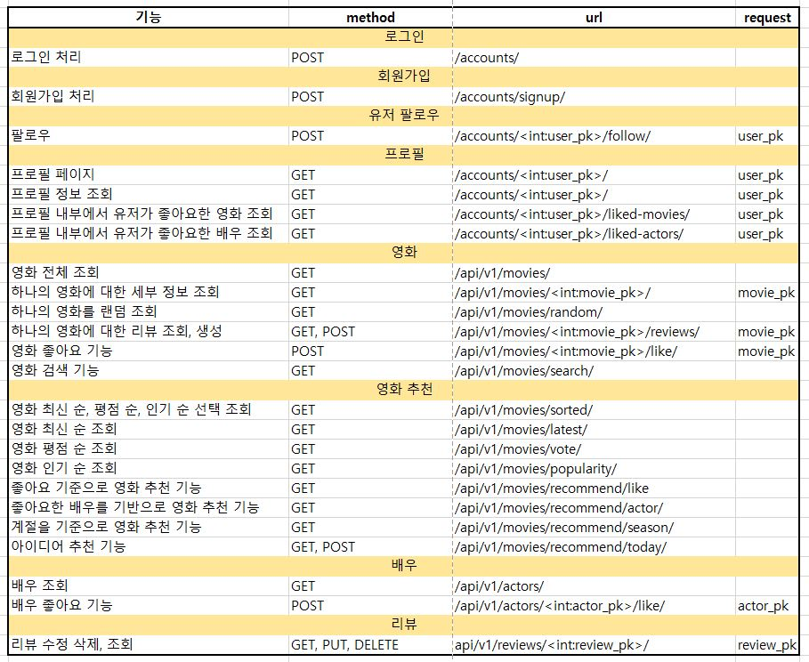
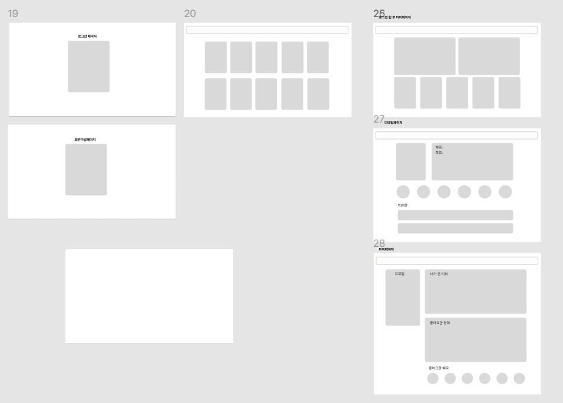

# 映画推薦アルゴリズムに基づくコミュニティサービス

## CineBite 🍿🎬
CineBiteは、ユーザーの気分、天気、食べたいスナックに基づいて最適な映画ジャンルと映画を推薦するカスタマイズされた映画推薦アルゴリズムに基づくコミュニティサービスです。

### 🏆 SSAFY 12期 1学期 貫通プロジェクト

- 期間：2024.11.17.(日) 〜 2024.11.26.(火)


### 🤝 チームメンバー

| 名前          | 担当領域                                                     | GitLab                       |
| ----------- | ------------------------------------------------------------ | ----------------------------- |
| チェ・ミヨン        | - フルスタック<br />- フロントエンドデザインの精緻化, バックエンドデータロジックの作成 |  mu05041  |
| イ・ジヒョン       | - 풀스택<br />- DBモデリング、バックエンドデータロジックの作成 |  w4277   |


### 📝 Description 

気分、天気、そして好きなスナックに基づいて映画情報とカスタマイズされた映画推薦サービスを提供するプロジェクトです。
企画意図：CineBiteはスナックの魅力を映画ジャンルと組み合わせて、楽しく没入感のある映画鑑賞体験を提供します。
企画意図：映画推薦に感覚的要素を加え、ユーザーがスナックと共に完璧な映画体験を楽しめるよう企画されました。
  


### 🥇 GOAL

- 映画データおよびユーザーデータに基づく推薦サービスの構成
- コミュニティサービスの構成
- HTML、CSS、JavaScript、Bootstrap、Vue.js、REST API、Databaseなどを活用した実際のサービス設計
1. 開発者としての成長
- ChatGPTに依存せず、チームメンバーと共に自らの力でプロジェクトを完成させ、協働能力と開発者としての実力を育てることを目標としました。
2. サービスの完成度
- 単純な映画推薦を超え、ユーザーの気分、天気、スナックなど個人の好みと瞬間の感覚を反映して、より楽しく特別な映画鑑賞体験を提供するサービスを作ることに重点を置きました。

### 💻 必須要件

| No.  | 区分               | 機能                                 | 実装度(⭐⭐⭐⭐⭐)                               |
| ---- | ------------------ | ------------------------------------ | -----------------------------------------------------|
| 1    | 映画データ         | 映画情報データ約800個ロード、各映画ごとに俳優6名ずつ追加ロード<br />->fixturesファイルにactors.json movies.jsonでデータ保存        | ⭐⭐⭐⭐⭐                       |
| 2    | 映画推薦アルゴリズム            |  3つ以上の推薦方式使用、<br /> ランダム推薦、季節別推薦、ユーザー情報に基づいた映画推薦        | ⭐⭐⭐⭐⭐    |
| 3    |  API               |  TMDB API、Chat GPT API         | ⭐⭐⭐⭐⭐                                              |
| 4    | コミュニティ            |  レビュー機能といいね、フォロー機能        | ⭐⭐⭐⭐⭐                                        |

### 🎨 目標サービス実装および実際の実装度

| No   | 機能                                                         | 機能説明                                                     | 実装度(⭐⭐⭐⭐⭐) | 実際の実装レベル                             |
| ---- | ------------------------------------------------ | ------------------------------------------------- | ---------------- | ------------------------------------------ |
| 1    | ログイン             | all authを通じたログイン機能実装                | ⭐⭐⭐⭐⭐          |    all authを通じたログイン機能実装                                                 |
| 2    | ログアウト              | all authを通じたログアウト機能実装                              | ⭐⭐⭐⭐⭐            |             all authを通じたログアウト機能実装                      |
| 3    | 会員登録         | all authを通じた会員登録機能実装           | ⭐⭐⭐⭐⭐      |   usernameとemail、passwordで会員登録可能        |
| 4    | マイページ         | ユーザー情報照会、他のユーザーフォロー機能、<br /> ユーザーが作成したレビュー照会、<br /> いいねした映画と俳優を集めて見ることおよびいいね取り消し提供、いいね取り消し時に非同期的に即時反映        | ⭐⭐⭐⭐      | ユーザー情報照会、他のユーザーフォロー機能、ユーザーが作成したレビュー照会して修正、削除機能まで実装成功、いいねした映画と俳優を集めて見ることおよびいいね取り消し提供、いいね取り消し時に非同期的に即時反映に成功したが映画詳細ページにいいね機能がうまく反映されない問題点発生 |
| 5    | メインページの特性  | ユーザーに楽しさと実用性を提供するために動くキャンディをクリックするとランダムで映画を推薦する機能実装 | ⭐⭐⭐⭐⭐ | ランダムで映画推薦を希望するユーザーのために既存の映画推薦ウェブページと差別化された機能実装| 
| 6    | メインページに映画フィルタリング機能       | メインページにカードカルーセル方式でユーザーが最新順、評価順、人気順で映画を照会できるよう実装       | ⭐⭐⭐⭐⭐         |  1つのカルーセルに6つの映画が表示されるようにしてユーザーに最新順、評価順、人気順で30の映画を照会できるよう実装                 | 
| 7    | 映画照会ページ | 全映画の中から映画をランダムで推薦するが、様々なジャンルが均等に推薦されるよう実装、国内、海外映画の比率を50:50に設定し均衡的に映画のタイトル、ポスター、評価照会 |  ⭐⭐⭐ | ランダムで12の映画推薦に成功したがジャンルの比率と国内、海外映画の比率を計算するロジック実装失敗 |
| 8   | 映画推薦ページ    |  ユーザーが入力した気分、天気、スナックに基づいた個人カスタマイズ映画推薦システム実装      | ⭐⭐⭐⭐⭐    |   ユーザーが入力した気分、天気、スナックに基づいて各項目に重みを付与し、それに合った映画ジャンルをフィルタリングした後、上位3つのジャンルを推薦し、各ジャンルに合った映画12個を提示する個人カスタマイズ映画推薦システム実装成功 + ユーザーの情報入力前に季節ベース映画推薦ロジック実装        |
| 9   | 映画いいね機能      | 全映画照会画面、映画詳細ページ画面にいいね機能実装およびいいね状態維持        | ⭐⭐⭐          |  全映画照会画面、映画詳細ページ画面にいいね機能実装したが映画のいいね状態維持一部成功              |
| 10   | 映画詳細ページでログイン状態と非ログイン状態によって画面を異なる表示にする      | 映画情報ページではログインしたユーザーにレビュー作成およびいいね機能を提供し、非ログインユーザーには映画のタイトル、あらすじなど基本情報のみ表示されるよう実装 | ⭐⭐⭐⭐⭐         | 映画情報ページではコンポーネントを分離してログインの有無によってログインしたユーザーにレビュー作成およびいいね機能を提供し、非ログインユーザーには映画のタイトル、あらすじなど基本情報のみ表示されるよう実装   |
| 11   | レビュー作成、修正、照会機能     |  投稿作成、照会、修正、削除はログインしたユーザーのみ可能であり、ユーザーは自分のデータに対してのみ追加作業を実行 | ⭐⭐⭐  |投稿作成、照会、修正、削除はログインしたユーザーのみ可能であり、ユーザーは自分のデータに対してのみ追加作業を実行       |
| 12   |  映画詳細ページで各映画別に作成されたレビューリスト照会      |   個別映画詳細ページでその映画に関連するレビュー照会およびレビュー修正、削除機能実装   | ⭐⭐⭐⭐⭐            | レビュー機能は評価と内容を作成できるよう実装、個別映画詳細ページでレビュー作成ボタンを提供し、作成されたレビューリスト照会可能で各レビューは詳細照会、修正、削除が可能なよう機能実装           |
| 13   | 映画に出演した俳優照会 | 俳優データを読み込んで映画詳細ページで映画に出演した俳優照会機能実装 | ⭐⭐⭐⭐⭐   | 映画詳細ページに映画に出演した主演および助演俳優6名の名前、写真の基本情報照会機能実装 | 
| 14   | 俳優いいね機能 | 俳優いいね機能を通じていいねした俳優の他の映画推薦ロジック実装 | ⭐⭐⭐⭐⭐   | 映画詳細ページに照会される俳優のいいね機能を実装して映画推薦ページにユーザーがいいねした俳優の他の映画作品を推薦する機能実装成功 | 
| 15   | 検索機能      |  ナビゲーションバーに検索機能を追加してログインしたユーザー、非ログインユーザー両方に実際のウェブページと類似した検索機能提供 + 検索した映画タイトルをクリックすると映画詳細ページに移動             |   ⭐⭐⭐⭐     |  ナビゲーションバーに検索機能を追加してログインしたユーザーと非ログインユーザー両方に提供したが、検索語と入力値が双方向バインディングされず、ユーザーが検索語を入力した後Enterキーを押すと検索モーダルフォームが開くが、現在のページではなく白背景ページでモーダルが開く問題発生                             |
| 16   | ダークモード                   |  ダークモードボタンをクリックしてダークモード適用                    |  ⭐⭐⭐⭐⭐       | ダークモードボタンをクリックしてダークモード適用成功        |
| 17    | チャットボット | チャットGPT APIを通じてチャットボット機能実装 + 映画詳細ページと連動 |   ⭐⭐⭐⭐ | ページ下部にChatGPT APIを活用したチャットボットを構成してAIを通じて映画を推薦してもらえるよう実装に成功したが映画詳細ページとの連動失敗 |


### 🧠 映画推薦アルゴリズムに関する技術的説明

- 映画推薦アルゴリズムは、ユーザーの入力（気分、天気、食べ物）に基づいて適切な映画ジャンルを推薦し、それに合った映画を提示する方式で実装されます。各入力値に対して適切なジャンルを設定し、そのジャンルに合った映画を推薦する構造です。

1. 基本基準設定
- 気分（Emotion）：ユーザーの気分に応じて推薦する映画ジャンルを決定します。例えば、気分が良ければ活気があり肯定的な映画（コメディ、アクション、アドベンチャーなど）を推薦し、気分が落ち込んでいれば感情的な映画（ドラマ、ロマンスなど）を推薦することができます。

- 天気（Weather）：天気に応じて映画ジャンルを推薦します。雨の日にはロマンスやドラマのような感情的でゆったりとした雰囲気の映画を、晴れて明るい日にはアクション、アドベンチャーなど活気があってダイナミックなジャンルを推薦することができます。

- 食べ物（Food）：私たちはスナックを食べ物として定め、スナックの特性に合った映画ジャンルを推薦します。スナックの味と感触を映画ジャンルに結びつけて推薦する方式です。

2. 食べ物別映画ジャンル推薦

- ゼリー（柔らかく爽やかな味、多様な色と形）
   - 映画ジャンル：ロマンス、ドラマ、コメディ
   - 推薦理由：ゼリーの柔らかく爽やかな特性は、感情的に穏やかに変化するストーリーや愛の感情を中心にする映画とよく合います。また、多様な色と形が与える楽しさは、明るく愉快なコメディ映画にもよく合います。

- チョコレート（濃厚で高級感のある味、様々な種類）
   - 映画ジャンル：ドラマ、ロマンス、感情的な映画
   - 推薦理由：チョコレートの高級感と深い味わいは、感情的で複雑な感情を扱う映画、特に真摯な感動を与えるドラマとロマンスジャンルとよく合います。チョコレートのように多様な層を持つ感情を持つ映画が適しています。

- お菓子（ビスケット、クッキーなど）（軽い食感、多様な味、簡単に分け合って食べる特性）
   - 映画ジャンル：家族映画、アニメーション、コメディ
   - 推薦理由：お菓子の軽い食感は、気軽に楽しめる映画を連想させます。家族と一緒に見るのに良く、家族全員が笑えるアニメーション映画や陽気なコメディ映画とよく合います。また、多様な味を楽しめるお菓子は、多様なキャラクターが登場するアニメーションや家族映画ともよく合います。

- キャンディ（強烈で甘い味、口の中で長く楽しめる特性）
   - 映画ジャンル：アドベンチャー、ファンタジー、アクション
   - 推薦理由：キャンディの強烈な味は、ダイナミックで多彩な経験を提供する映画とよく合います。キャンディのように感覚的に強烈な経験を与えるアドベンチャー、ファンタジー、アクション映画がキャンディの特性とよく合います。また、キャンディのように多彩で神秘的な要素がある映画が適しています。

- コーヒー（濃厚で苦味のある味、エネルギーを与える感じ）
   - 映画ジャンル：スリラー、ミステリー、犯罪
   - 推薦理由：コーヒーの濃厚で苦い味は、緊張感あふれるスリラーやミステリージャンルとよく合います。コーヒーのように内面を満たす複雑なストーリーラインと速いテンポを持つ映画が似合います。コーヒーを飲みながら集中するように、このようなジャンルの映画は観客を没入させます。


3. 映画ジャンルマッチング
- 映画ジャンルは全18種類に区分され、各ジャンルは特定の感情や状況に合わせて推薦されます：
  - SF、アクション、アドベンチャー、スリラー、ホラー：気分が活気に満ち、天気が晴れているか冒険的な時に推薦されます。
  - ドラマ、ロマンス、メロドラマ、家族、アニメーション：気分が感情的で快適な状況で推薦されます。
  - 犯罪、ミステリー、ファンタジー、西部劇、音楽、ドキュメンタリー、歴史、戦争：様々な感情と状況によって選択できるジャンルです。

4. アルゴリズムフロー
- 入力値収集：ユーザーの気分、天気、食べ物の選択を受け取ります。
- ジャンル推薦：各入力値に応じて該当する映画ジャンルを推薦します。
- 推薦映画提示：推薦されたジャンルに合った映画をデータベースから呼び出してユーザーに推薦します。

### 🤔 核心機能に関する説明

#### メインページの楽しさの要素
- メインページにユーザーに楽しさと実用性を同時に提供するため、スナックをコンセプトにした動くキャンディ要素を追加しました。
- キャンディをクリックするとランダムで映画が推薦され、推薦された映画の詳細ページに移動できる機能を実装しました。
- 既存の映画推薦ウェブページとは差別化された方式で、ランダム推薦機能を通じてユーザーに新しい映画体験を提供すると同時に、インタラクティブな要素でウェブ使用の楽しさをさらに最大化するよう努力しました。


```python
# 랜덤으로 한 영화를 추천
@api_view(['GET'])
def movie_random_detail(request, movie_pk=None):
    # movie_pk가 없으면 랜덤으로 선택
    if movie_pk is None:
        movie_count = Movie.objects.count()
        if movie_count == 0:
            return Response({"error": "No movies available."}, status=404)
        random_index = random.randint(0, movie_count - 1)
        movie = Movie.objects.all()[random_index]
    else:
        movie = get_object_or_404(Movie, pk=movie_pk)

    serializer = MovieSerializer(movie)
    return Response(serializer.data)
```

#### 映画推薦ロジック
##### ユーザーの好みに基づいた映画推薦
###### 1. 映画いいねに基づいた映画推薦
- ユーザーがいいねした映画のジャンルに基づき、ユーザーがまだいいねを押していない類似ジャンルの映画を推薦するロジックを実装しました。
- 各ジャンルの比率に合わせて推薦映画数を決め、重複を避けながら最終的に15の推薦映画をランダムに返す方式です。
```python
@api_view(['GET'])
def recommend_like_movies(request):
    # 인증된 사용자만 접근 가능
    if not request.user.is_authenticated:
        return Response({'detail': 'Authentication credentials were not provided.'}, status=401)
    
    # 사용자가 좋아요를 누른 영화들을 가져옴
    liked_movies = request.user.like_movies.all()
    
    # 사용자가 좋아한 영화들의 장르 추출
    liked_genres = liked_movies.values_list('genres', flat=True)
    
    # 장르별 비율 계산
    genre_count = Counter(liked_genres)
    total_genres = len(liked_genres)
    
    # 각 장르의 비율 계산 (0과 나누는 에러 방지)
    genre_ratio = {genre: count / total_genres for genre, count in genre_count.items()}
    
    # 추천 영화들을 담을 리스트
    recommended_movies = []
    
    # 장르 비율에 맞춰 추천 영화 추출
    for genre, ratio in genre_ratio.items():
        # 장르에 맞는 영화를 찾고, 사용자가 아직 좋아요를 누르지 않은 영화를 필터링
        genre_movies = Movie.objects.filter(genres=genre).exclude(like_users=request.user)
        
        # 추천할 영화 수를 비율에 맞춰 결정 (최대 15개 추천)
        num_recommended = int(ratio * 15)
        num_recommended = max(num_recommended, 3)  # 최소 1개 영화는 추천
        
         # 무작위로 선택 (단, 영화 수가 부족할 경우 최대 가능한 수만 선택)
        genre_movies = list(genre_movies)
        if genre_movies:
            sampled_movies = random.sample(genre_movies, min(len(genre_movies), num_recommended))
            recommended_movies.extend(sampled_movies)
    
    # 추천 영화들을 직렬화
    recommended_movies = list(set(recommended_movies))  # 중복 제거
    recommended_movies = random.sample(recommended_movies, min(len(recommended_movies), 15)) 
    
    # 직렬화
    serializer = MovieSerializer(recommended_movies, many=True)
    return Response(serializer.data)
```

###### 2. 俳優いいねに基づいた俳優の他の映画推薦機能
- ユーザーがいいねした俳優の映画の中から、ユーザーがまだいいねを押していない映画を推薦する機能です。
- 各俳優について最大3つの映画をランダムに選択し、重複を避けながら最終的に最大15の映画を推薦します。
```python
@api_view(['GET'])
def recommend_like_actors(request):
      # 인증된 사용자만 접근 가능
    if not request.user.is_authenticated:
        return Response({'detail': 'Authentication credentials were not provided.'}, status=401)
    
    # 사용자가 좋아요를 배우들을 가져옴
    liked_actors = request.user.like_actors.all()
    
    # 추천할 영화들을 담을 리스트
    recommended_movies = []
    
    # 사용자가 좋아요한 배우들의 다른 영화들을 추천
    for actor in liked_actors:
        # 해당 배우가 출연한 영화들 가져오기
        actor_movies = Movie.objects.filter(actors=actor).exclude(like_users=request.user)
        
        # 추천할 영화들을 비율에 맞춰 추출 (최대 15개 추천)
        num_recommended = min(len(actor_movies), 3)  # 최소 1개 영화는 추천
        
        # 무작위로 선택 (단, 영화 수가 부족할 경우 최대 가능한 수만 선택)
        actor_movies = list(actor_movies)
        if actor_movies:
            sampled_movies = random.sample(actor_movies, num_recommended)
            recommended_movies.extend(sampled_movies)
    
    # 추천 영화들을 직렬화
    recommended_movies = list(set(recommended_movies))  # 중복 제거
    recommended_movies = random.sample(recommended_movies, min(len(recommended_movies), 15))

    # 직렬화
    serializer = MovieSerializer(recommended_movies, many=True)
    return Response(serializer.data)
```

##### 最新順、人気順、評価順による映画推薦
- 最新順で映画を推薦する際、映画データに公開予定の映画が含まれているため、現在の日付を基準に以前に公開された最新の映画30作品を返すよう実装しました。
- 人気順と評価順はそれぞれ映画リストを人気順および評価順でソートし、上位30作品を返すことで、ユーザーが希望する基準に合った映画を推薦するようにしました。
```python
@api_view(['GET'])
def movie_latest(request):
    today = datetime.now().date()  # 현재 날짜
    # 오늘 이전에 개봉한 영화만 포함
    movies = Movie.objects.filter(release_date__lte=today).order_by('-release_date')[:30]
    # 시리얼라이저를 사용하여 데이터 직렬화
    serializer = MovieListSerializer(movies, many=True)

    # JSON 응답 반환
    return Response(serializer.data)


@api_view(['GET'])
def movie_popularity(request):
    movies = Movie.objects.order_by('-popularity')[:30]  # 인기순
    # 시리얼라이저를 사용하여 데이터 직렬화
    serializer = MovieListSerializer(movies, many=True)
    # JSON 응답 반환
    return Response(serializer.data)


@api_view(['GET'])
def movie_vote(request):
    movies = Movie.objects.order_by('-vote_average')[:30]  # 평점순
    # 시리얼라이저를 사용하여 데이터 직렬화
    serializer = MovieListSerializer(movies, many=True)
    # JSON 응답 반환
    return Response(serializer.data)
```

##### 季節に合わせたジャンルに基づく映画推薦
- ユーザーからリクエストがあった際に、現在の季節に合った映画ジャンルに基づいて推薦映画リストを返す機能を実装しました。
- 季節に合った映画ジャンルを設定する際、各季節の雰囲気に関連する一般的な映画ジャンルの傾向を参考にしました。
```python
# 계절에 따른 영화 추천 기능
def get_season():
    month = datetime.now().month
    if 3 <= month <= 5:
        return "봄"  # 봄
    elif 6 <= month <= 8:
        return "여름"  # 여름
    elif 9 <= month <= 11:
        return "가을"  # 가을
    else:
        return "겨울"  # 겨울

def get_seasonal_genre(season):
    seasonal_genres = {
        "spring": ["로맨스", "드라마"],
        "summer": ["액션", "모험", "스릴러", "코미디"],
        "autumn": ["미스터리", "SF", "드라마", "스릴러", "역사"],
        "winter": ["코미디", "로맨스", "가족", "애니메이션"]
    }
    return seasonal_genres.get(season, [])

@api_view(['GET'])
def recommend_season(request):
    # 현재 계절을 가져옴
    season = get_season()
    # 계절에 맞는 영화 장르 목록을 가져옴
    genres = get_seasonal_genre(season)

    # Q 객체를 사용하여 여러 장르에 대해 OR 조건을 생성
    q = Q()
    for genre in genres:
        q |= Q(genres__contains=genre)
    
    # 영화 필터링: 계절에 맞는 장르가 하나라도 포함된 영화들만 필터링
    recommended_movies = list(Movie.objects.filter(q))
    
    # 랜덤으로 15개의 영화를 선택 (단, 영화 데이터가 15개 미만일 경우 모든 영화 반환)
    recommended_movies = random.sample(recommended_movies, min(len(recommended_movies), 15))

    # MovieSerializer와 연관해서 필터링
    serializer = MovieSerializer(recommended_movies, many=True)
    
    # 계절 정보와 추천된 영화 목록을 반환
    return Response({
        'season': season,
        'recommended_movies': serializer.data
    })
```

##### ユーザーが入力した情報に基づく映画推薦
- ユーザーが提供した情報に基づいて映画を推薦できるようにモデルを設計しました。
- ユーザーが入力した感情(emotion)、天気(weather)、食べ物(food)の情報に基づき、各項目に合った重みを反映して映画ジャンルの推薦スコアを計算し、それを通じて映画を推薦する機能を実装しました。
- 映画ジャンル推薦スコアは、各映画ジャンルをキー(key)として、該当ジャンルの推薦スコアを値(value)として保存するgenre_scoresというディクショナリを作成して管理しました。
- 計算された上位3つのジャンルを基準に、映画モデルから該当ジャンルを持つ映画をフィルタリングし、ユーザーにカスタマイズされた映画推薦を提供します。



```python
class Recommended(models.Model):
    user = models.ForeignKey(settings.AUTH_USER_MODEL, on_delete=models.CASCADE, related_name="recommends")
    emotion = models.IntegerField(null=True)  # 사용자의 기분 (1~100 범위로 저장)
    weather = models.CharField(max_length=100)  # 날씨 
    food = models.CharField(max_length=100)  # 음식
    created_at = models.DateTimeField(auto_now_add=True)  # 저장 시간
    recommended_movies = models.TextField(blank=True, null=True)
    recommended_genres = models.TextField(blank=True, null=True)
```
```python
from rest_framework.response import Response
from rest_framework.decorators import api_view
import random
from collections import defaultdict
from .serializers import MovieSerializer, TodaySerializer
from .models import Movie, Recommended
from rest_framework import status
from django.db.models import Q


@api_view(['GET', 'POST'])
def today(request):
    if request.method == 'GET':
        recommended = Recommended.objects.all()
        serializer = TodaySerializer(recommended, many=True)
        return Response(serializer.data)
    
    elif request.method == 'POST':
        serializer = TodaySerializer(data=request.data)
        print("Received POST request with data:", request.data)
        
        # 감정, 날씨, 음식 정보 저장 및 장르 추천 로직
        if serializer.is_valid(raise_exception=True):
            emotion = serializer.validated_data['emotion']
            weather = serializer.validated_data['weather']
            food = serializer.validated_data['food']
            
            # 기본 장르 추천 기준 설정
            genre_scores = defaultdict(int)
            genres = []

            # 기분에 따른 장르 점수 추가
            if emotion > 70:
                genre_scores['액션'] += 30
                genre_scores['코미디'] += 30
                genre_scores['애니메이션'] += 20
                genres.extend(['액션', '코미디', '애니메이션'])
            elif emotion < 30:
                genre_scores['코미디'] += 20
                genre_scores['다큐멘터리'] += 40
                genre_scores['음악'] += 30
                genres.extend(['코미디', '다큐멘터리', '음악'])
            else:
                genre_scores['스릴러'] += 20
                genre_scores['미스터리'] += 20
                genre_scores['로맨스'] += 20
                genres.extend(['스릴러', '미스터리', '로맨스'])

            # 날씨에 따른 장르 점수 추가
            if weather == '맑음':
                genre_scores['액션'] += 20
                genre_scores['모험'] += 20
                genres.extend(['액션', '모험'])
            elif weather == '비':
                genre_scores['스릴러'] += 30
                genre_scores['미스터리'] += 20
                genre_scores['SF'] += 20
                genre_scores['공포'] += 20
                genres.extend(['스릴러', '미스터리', 'SF', '공포'])
            elif weather == '흐림':
                genre_scores['판타지'] += 20
                genre_scores['전쟁'] += 30
                genre_scores['범죄'] += 30
                genres.extend(['판타지', '전쟁', '범죄'])
            elif weather == '눈':
                genre_scores['음악'] += 20
                genre_scores['가족'] += 30
                genre_scores['역사'] += 20
                genres.extend(['음악', '가족', '역사'])
            
            # 음식에 따른 장르 점수 추가
            if food == '젤리':  # 젤리
                genre_scores['드라마'] += 20
                genre_scores['액션'] += 30
                genres.extend(['드라마', '액션'])
            elif food == '초콜릿':  # 초콜릿
                genre_scores['로맨스'] += 20
                genre_scores['멜로'] += 30
                genres.extend(['멜로', '로맨스'])
            elif food == '과자':  # 과자
                genre_scores['애니메이션'] += 25
                genre_scores['가족'] += 40
                genre_scores['다큐멘터리'] += 30
                genre_scores['역사'] += 20
                genres.extend(['애니메이션', '가족', '다큐멘터리', '역사'])
            elif food == '사탕':  # 사탕
                genre_scores['모험'] += 30
                genre_scores['판타지'] += 20
                genre_scores['스릴러'] += 20
                genres.extend(['모험', '판타지', '스릴러'])


            # 장르 점수 높은 순으로 정렬 후 상위 3개의 장르 선택
            sorted_genres = sorted(genre_scores.items(), key=lambda x: x[1], reverse=True)
            genres = [genre for genre, score in sorted_genres[:3]]
            print("Final genres:", genres)  

            # 장르 점수 비율 계산
            total_score = sum(genre_scores.values())
            if total_score == 0:
                return Response({"detail": "No valid genre scores."}, status=status.HTTP_400_BAD_REQUEST)

            # Q 객체를 사용하여 여러 장르에 대해 OR 조건을 생성
            q = Q()
            for genre in genres:
                q |= Q(genres__contains=genre)

            # 필터링된 영화들을 랜덤으로 15개 추천
            recommended_movies = Movie.objects.filter(q)

            # 추천된 영화가 12개 이상일 경우 랜덤으로 12개 선택 (영화가 12개 미만일 경우 모두 반환)
            recommended_movies = random.sample(list(recommended_movies), min(len(recommended_movies), 12))

            # 추천된 영화들 직렬화
            movie_serializer = MovieSerializer(recommended_movies, many=True)

            # 추천 정보를 DB에 저장
            recommended_instance = Recommended.objects.create(
                user=request.user, 
                emotion=emotion, 
                weather=weather, 
                food=food,
                recommended_movies=recommended_movies,  # 추천된 영화들을 저장
                recommended_genres=genres,
            )

             # 저장된 인스턴스 직렬화
            today_serializer = TodaySerializer(recommended_instance)

            return Response({ 
                'recommended_genres': genres,
                'recommended_movies': movie_serializer.data,
                'today_serializer': today_serializer.data }
                , status=status.HTTP_200_OK)

```

### 🤖 生成型AIを活用した部分

#### 生成型AIを活用してプロンプトエンジニアリングを通じた機能実装
- 貫通プロジェクト7-pjtで行ったチャレンジ課題のコードを活用して検索機能を完成させたいと思いました。
```python
from django.shortcuts import render
from django.db.models import Q
from rest_framework.decorators import api_view
from rest_framework import status
from rest_framework.response import Response
from .models import Actor, Movie, Review

@api_view(['GET'])
def search(request):
    query = request.GET.get('search', '')  # 쿼리 파라미터에서 검색어 가져오기
    if query:
        movies = Movie.objects.filter(Q(title__icontains=query) | Q(overview__icontains=query))  # 제목 또는 개요에서 검색
    else:
        movies = Movie.objects.none()
    serializer = MovieListSerializer(movies, many=True)
    return Response(serializer.data)
```
- 上記のコードは単純に映画データベースからユーザーが入力した検索ワードに従って関連映画を照会する機能で、もし検索ワードが提供されなかった場合はデフォルト値として空の文字列を使用しました。
- 映画検索機能を実装するためにChatGPTを利用しました。





- プロンプトエンジニアリングを通じて完成した映画検索機能は次の通りです。
```python
# 영화 검색 기능
def similarity_score(a, b):
    """Calculate similarity score between two strings."""
    return SequenceMatcher(None, a, b).ratio()


@api_view(['GET'])
def search_movie(request):
    query = request.GET.get('search', '').strip()  # 쿼리 파라미터에서 검색어 가져오기
    if not query:  # 검색어가 없거나 빈 문자열인 경우
        return Response(
            {"message": "검색어를 입력해주세요."},
            status=400  # Bad Request
        )

    # 제목 또는 개요에서 검색
    movies = Movie.objects.filter(Q(title__icontains=query) | Q(overview__icontains=query))
    if not movies.exists():  # 검색 결과가 없는 경우
        return Response(
            {"message": f"'{query}'에 대한 검색 결과가 없습니다."},
            status=404  # Not Found
        )

    # 중복 제거 (중복 영화를 제거)
    unique_movies = {movie.id: movie for movie in movies}.values()

    # 유사도 계산 및 정렬
    movies_with_similarity = []
    for movie in unique_movies:
        similarity = similarity_score(query.lower(), movie.title.lower())
        movie.similarity = similarity  # `MovieSearchSerializer`의 `similarity` 필드 사용
        movies_with_similarity.append(movie)

    # 유사도 기준으로 정렬
    sorted_movies = sorted(movies_with_similarity, key=lambda x: x.similarity, reverse=True)[:15]

    # 직렬화 및 응답 반환
    serializer = MovieSearchSerializer(sorted_movies, many=True)
    return Response(serializer.data)
```




#### ウェブページに生成型AI機能を統合
- OpenAIのGPT APIを活用してユーザーと相互作用するチャットボット機能をウェブページに統合しました。
- ユーザーが入力したメッセージに対してチャットボットが応答を生成し、会話が行われるように実装されました。





### 🛠Tech Stack


### 💾 データベースモデリング(ERD)



### 🔲 コンポーネント構造



### 🔗 URL仕様



### 💡 UX/UI設計




### 📅 開発日誌および業務分担内容

| 日付                | 詳細役割            |  担当者   |
| ----------------- | -------------- | ------------------------------------ |
|  11-17(日)  | - ERD構成<br /> - コンポーネント設計<br /> - UX/UI設計	     |  チェミヨン,<br />イジヒョン   |
|                |- vueプロジェクト作成 <br /> - Figma設計	      |   チェミヨン   |
|             | - ログイン機能 <br /> - 会員登録機能 <br /> - ログアウト機能<br /> - 会員登録/ログイン時トークン認証   | イジヒョン  |
| 11-18(月)  | - 映画リスト照会 <br /> - 単一映画照会 <br /> - 映画リスト照会ページ<br /> - 単一映画照会ページ<br /> - 単一映画照会ページ下部に映画に関するレビュー出力    |   イジヒョン    |
|                    |	- データをTMDBから読み込み<br /> - レビューCRUD → レビュー作成、レビュー照会、レビュー修正、レビュー削除<br />  - 観客順(popularity)映画リスト照会<br /> - メインページデザイン<br /> - ナビゲーションバーデザイン	|  チェミヨン  |
| 11-19(火)   |	- レビュー作成フォーム実装<br /> - レビュー照会、修正、削除ボタン実装<br /> - いいねボタン全映画リスト照会ページに実装<br /> - いいね機能実装 | イジヒョン |
|                 | - プロフィールページ <br />→ レビューを作成したユーザーをクリックするとプロフィールページに移動<br /> - プロフィールページにユーザーがいいねした映画とユーザーが作成したレビューリスト照会<br /> - フォロー機能実装<br /> - ログインしたユーザーにログインを表示せずログアウトを表示するよう実装	|  チェミヨン   |
|11-20(水)	|- 俳優モデルと映画に関する俳優を照会できるよう実装 <br /> - 俳優照会機能実装 <br /> - いいね推薦アルゴリズム実装（コンテンツベース） <br /> - 季節ベース推薦アルゴリズム実装 - 映画検索機能実装	 |イジヒョン |
|                  | - 映画、俳優情報に関するデータ再読み込み <br /> - DBに出演俳優情報、Backdrop_path情報追加 <br /> - メイン推薦アルゴリズム生成 <br /> - 映画推薦ページカルーセル追加 <br /> - ウェブデザインを美しく変更 |	 チェミヨン |
| 11-21(木)       |	- 映画データから俳優3名から6名に増やしてデータ読み込み<br /> - 俳優いいね機能実装 <br /> - いいねした俳優の他の作品推薦アルゴリズム実装 <br /> - メイン推薦ロジック機能実装 <br /> - マイページいいねした俳優機能追加 <br /> - 映画詳細ページに俳優情報出力、いいね機能追加 <br /> - マイページデザイン実装 <br /> - メイン推薦アルゴリズムページと映画推薦ページ統合 <br /> - 映画推薦ページにいいねした俳優の他の作品推薦カルーセル追加<br /> - メイン推薦アルゴリズムデザイン| 	チェミヨン,<br />イジヒョン |
| 11-22(金)    | - レビュー作成フォームをモーダルに変更<br /> - レビュー詳細修正削除をモーダルに変更<br /> - 最新+人気+評価順映画照会<br /> - マイページでいいねボタンを表示させキャンセルできるよう修正 <br /> - 映画推薦ページデザイン完成 <br /> - マイページで映画照会時ポスターが切れないようにする <br /> - メイン映画推薦ページでレスポンシブウェブページに変更 <br /> - メインアルゴリズム完成	 | イジヒョン,<br />チェミヨン |
| 11-23(土)	|- チャットボット追加 <br /> - メインページロゴイメージ変更 <br /> - 会員登録画面を美しく装飾 <br /> - 非ログインとログインの映画詳細を異なるようにする | チェミヨン,<br />イジヒョン  |
| 11-24(日)  | - ERD最終的に修正 <br /> - ダークモード生成 <br /> - いいね機能エラー認識	|チェミヨン,<br />イジヒョン |
| 11-25(月) 	| - いいね機能エラー解決<br /> → 前にログインしたユーザーがいいねしたハートボタンがそのまま表示される<br /> - レビュー修正、削除は作成したユーザーのみ可能にする	 | チェミヨン,<br />イジヒョン |
| 11-26(火)	  | - 機能が動作するか確認しながらエラー修正 <br /> - README完成  <br />	- URL仕様作成  <br /> - コンポーネント構造最終的に修正 <br /> - 発表資料準備| チェミヨン,<br />イジヒョン|

### 🤔 感想

#### チェ・ミヨン
振り返ってみると大変なこともあったけれど、楽しかったと思う。開発は初めてだったが、開発者の苦労を体験できた良い経験だった。始める前は簡単そうに見えたことが解決するのが難しく、難しそうに見えたことが意外とスムーズに終わった。やはり、やってみるまでは何が起こるか分からないという教訓を得た。アイデアのロジック実装に時間がかかりそうで、他のものに変えるべきか悩んだけれど、変えずにこれで進めて良かったと思う。可愛くて気に入っている。いいね機能が少し難しかったが、それでも勉強になった。これからはいいねの状態をローカルストレージで管理してはいけないということを学んだ。それでも多くのことを学ぶことができて良かった。

#### イ・ジヒョン
貫通プロジェクトは初めてだったので少し怖かったし、ウェブページの実装を始めるにあたって心配が多かった。最初は学期中に習った映画情報の照会、映画のいいね機能、フォロー機能など基本的なコードを実装しながら急いで進めたが、その過程でミスが多く、特にいいね機能がうまく動作しないということを後になって知った時には、すでに様々な機能が絡み合っていて修正が簡単ではなかった。最初に機能を実装する時は、他の機能の実装を十分に考慮せず、現在の機能に集中していた点が後にコードを修正できないほど間違った道に入り込み、チャットGPTに依存することになった。そのため、その過程でコード作成においてより慎重にならなければならないという点に気づいた。プロジェクトを成功裏に終えながら、思ったより最初に感じていた恐れは解消され、ある程度実在するウェブサイトと類似したものを作ることができて達成感を感じた。